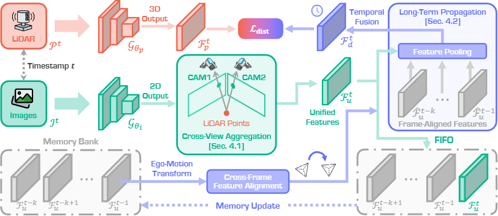
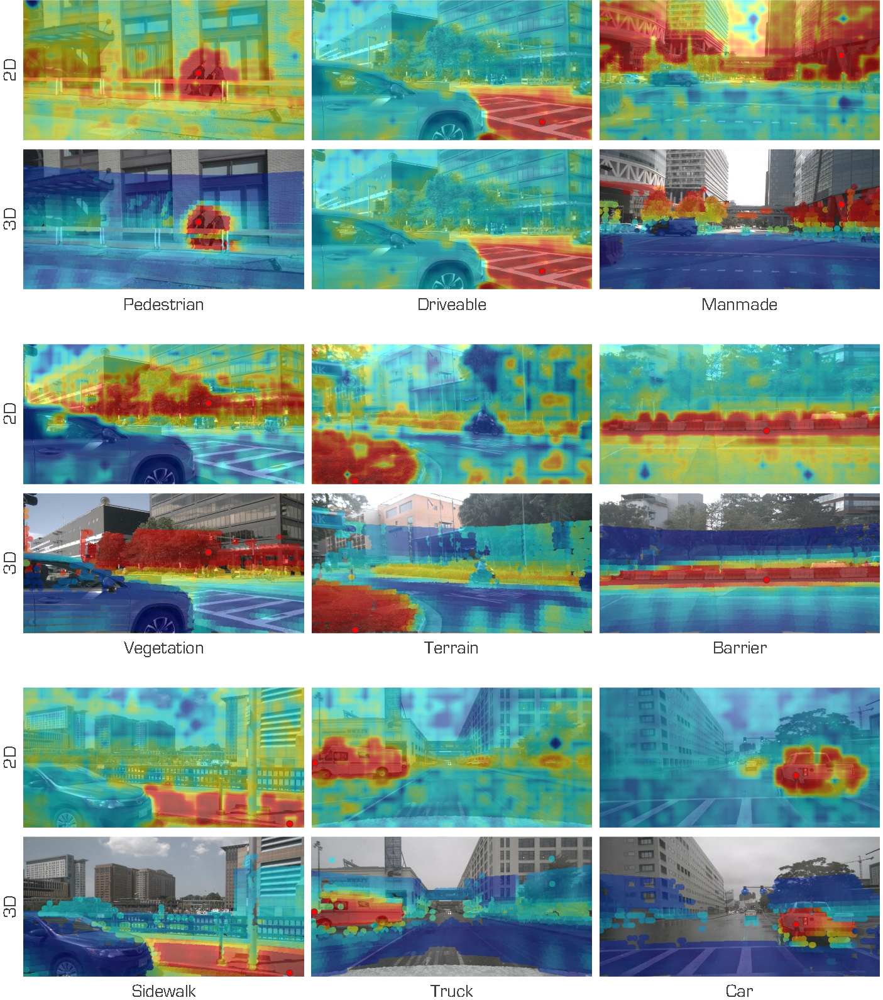
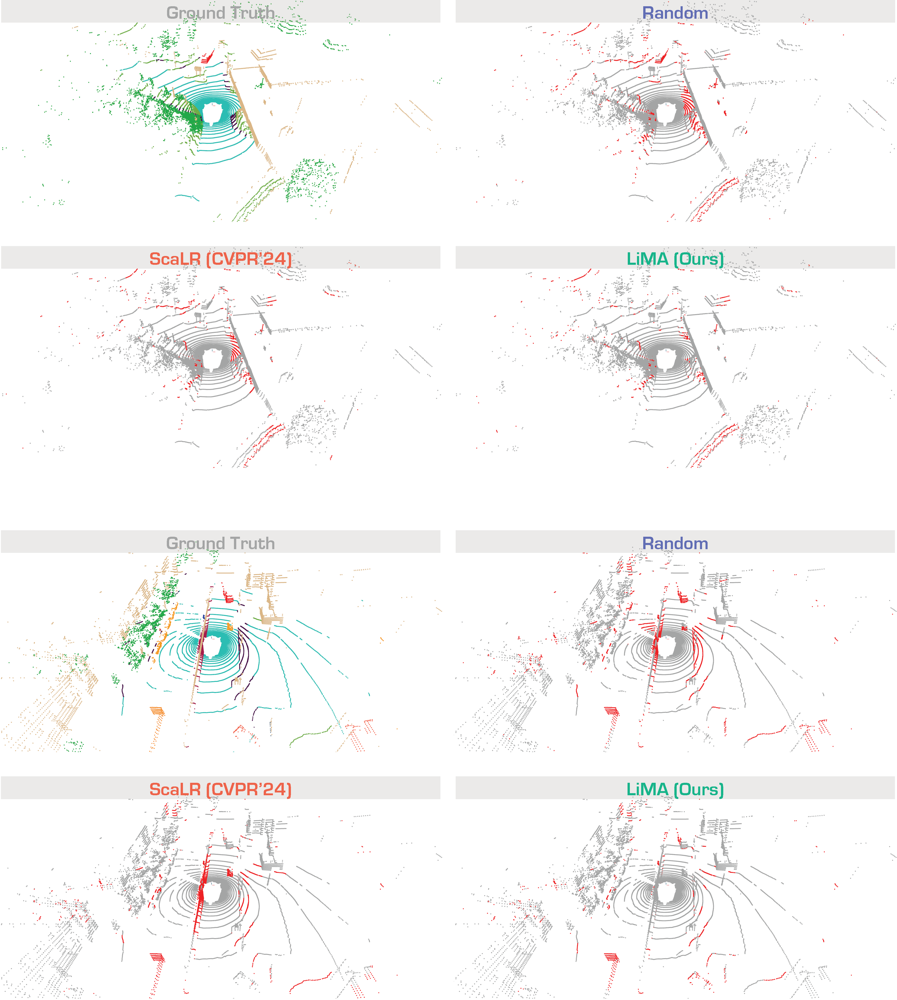
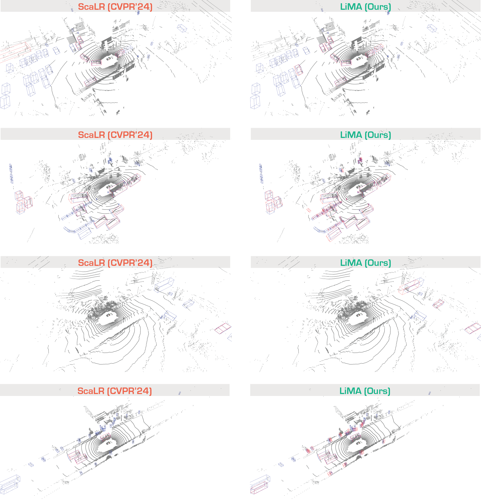

<div align="right">English | <a href="./README_CN.md">简体中文</a></div>

<div align="center">
    <h2><strong>Beyond One Shot, Beyond One Perspective: Cross-View and Long-Horizon Distillation for Better LiDAR Representations</strong></h2>
</div>

<div align="center">
    <a href="https://xiangxu-0103.github.io/" target='_blank'>Xiang Xu</a><sup>1</sup>&nbsp;&nbsp;&nbsp;
    <a href="https://ldkong.com/" target='_blank'>Lingdong Kong</a><sup>2</sup>&nbsp;&nbsp;&nbsp;
    <a href="https://songw-zju.github.io/" target='_blank'>Song Wang</a><sup>3</sup>&nbsp;&nbsp;&nbsp;
    <a href="https://github.com/deepcharle" target='_blank'>Chuanwei Zhou</a><sup>4</sup>&nbsp;&nbsp;&nbsp;
    <a href="https://scholar.google.com/citations?user=2Pyf20IAAAAJ" target='_blank'>Qingshan Liu</a><sup>4</sup>&nbsp;&nbsp;&nbsp;
    </br></br>
    <sup>1</sup>NUAA&nbsp;&nbsp;&nbsp;
    <sup>2</sup>NUS&nbsp;&nbsp;&nbsp;
    <sup>3</sup>ZJU&nbsp;&nbsp;&nbsp;
    <sup>4</sup>NJUPT&nbsp;&nbsp;&nbsp;
</div>

<br/>

<div align="center">
    <a href="" target='_blank'>
        
    </a>&nbsp;
    <a href="https://xiangxu-0103.github.io/LiMA" target='_blank'>
        
    </a>&nbsp;
    <a href="" target='_blank'>
        
    </a>&nbsp;
    <a href="" target='_blank'>
        
    </a>&nbsp;
    <a href="" target='_blank'>
        
  </a>
</div>

# About

LiMA is a novel long-term image-to-LiDAR Memory Aggregation framework that explicitly captures longer range temporal correlations to enhance LiDAR representation learning. It comprises three key components: 1) a **Cross-View Aggregation** module that aligns and fuses overlapping regions across neighboring camera views, constructing a more unified and redundancy-free memory bank; 2) a **Long-Term Feature Propagation** mechanism that efficiently aligns and integrates multi-frame image features, reinforcing temporal coherence during LiDAR representation learning; and 3) a **Cross-Sequence Memory Alignment** strategy that enforces consistency across driving sequences, improving generalization to unseen environments.



## :memo: Updates

- \[2025.06\] - Our paper **LiMA** has been accepted to **ICCV 2025**! :tada:

# Table of Content

- [Installation](#gear-installation)
- [Data Preparation](#hotsprings-data-preparation)
- [Getting Started](#rocket-getting-started)
- [Main Results](#bar_chart-main-results)
- [License](#license)
- [Citation](#citation)
- [Acknowledgments](#acknowledgments)

# :gear: Installation

For details related to installation and environment setups, kindly refer to [INSTALL.md](./docs/INSTALL.md).

# :hotsprings: Data Preparation

Kindly refer to [DATA_PREPAER.md](./docs/DATA_PREPAER.md) for the details to prepare the datasets.

# :rocket: Getting Started

To learn more usage about this codebase, kindly refer to [GET_STARTED.md](./docs/GET_STARTED.md).

# :bar_chart: Main Results

## Comparisons of State-of-the-Art Pretraining Methods

<table>
    <tr>
        <th rowspan="2">Method</th>
        <th rowspan="2">Venue</th>
        <th rowspan="2">Backbone (2D)</th>
        <th rowspan="2">Backbone (3D)</th>
        <th rowspan="2">Frames</th>
        <th colspan="6">nuScenes</th>
        <th colspan="1">KITTI</th>
        <th colspan="1">Waymo</th>
    </tr>
    <tr>
        <th>LP</th>
        <th>1%</th>
        <th>5%</th>
        <th>10%</th>
        <th>25%</th>
        <th>Full</th>
        <th>1%</th>
        <th>1%</th>
    </tr>
    <tr>
        <td>Random</td>
        <td>-</td>
        <td>-</td>
        <td>-</td>
        <td>-</td>
        <td>8.10</td>
        <td>30.30</td>
        <td>47.84</td>
        <td>56.15</td>
        <td>65.48</td>
        <td>74.66</td>
        <td>39.50</td>
        <td>39.41</td>
    </tr>
    <tr>
        <td>SLidR</td>
        <td>CVPR'22</td>
        <td>ViT-S</td>
        <td>MinkUNet-34</td>
        <td>1</td>
        <td>44.70</td>
        <td>41.16</td>
        <td>53.65</td>
        <td>61.47</td>
        <td>66.71</td>
        <td>74.20</td>
        <td>44.67</td>
        <td>47.57</td>
    </tr>
    <tr>
        <td>Seal</td>
        <td>NeurIPS'23</td>
        <td>ViT-S</td>
        <td>MinkUNet-34</td>
        <td>2</td>
        <td>45.16</td>
        <td>44.27</td>
        <td>55.13</td>
        <td>62.46</td>
        <td>67.64</td>
        <td>75.58</td>
        <td>46.51</td>
        <td>48.67</td>
    </tr>
    <tr>
        <td>SuperFlow</td>
        <td>ECCV'24</td>
        <td>ViT-S</td>
        <td>MinkUNet-34</td>
        <td>3</td>
        <td>46.44</td>
        <td>47.81</td>
        <td>59.44</td>
        <td>64.47</td>
        <td>69.20</td>
        <td>76.54</td>
        <td>47.97</td>
        <td>49.94</td>
    </tr>
    <tr>
        <td>ScaLR</td>
        <td>CVPR'24</td>
        <td>ViT-S</td>
        <td>MinkUNet-34</td>
        <td>1</td>
        <td>49.66</td>
        <td>45.89</td>
        <td>56.52</td>
        <td>61.07</td>
        <td>65.79</td>
        <td>73.39</td>
        <td>46.06</td>
        <td>47.67</td>
    </tr>
    <tr>
        <td><b>LiMA</b></td>
        <td><b>Ours</b></td>
        <td><b>ViT-S</b></td>
        <td><b>MinkUNet-34</b></td>
        <td><b>6</b></td>
        <td><b>54.76</b></td>
        <td><b>48.75</b></td>
        <td><b>60.83</b></td>
        <td><b>65.41</b></td>
        <td><b>69.31</b></td>
        <td><b>76.94</b></td>
        <td><b>49.28</b></td>
        <td><b>50.23</b></td>
    </tr>
    <tr>
        <td>SLidR</td>
        <td>CVPR'22</td>
        <td>ViT-B</td>
        <td>MinkUNet-34</td>
        <td>1</td>
        <td>45.35</td>
        <td>41.64</td>
        <td>55.83</td>
        <td>62.68</td>
        <td>67.61</td>
        <td>74.98</td>
        <td>45.50</td>
        <td>48.32</td>
    </tr>
    <tr>
        <td>Seal</td>
        <td>NeurIPS'23</td>
        <td>ViT-B</td>
        <td>MinkUNet-34</td>
        <td>2</td>
        <td>46.59</td>
        <td>45.98</td>
        <td>57.15</td>
        <td>62.79</td>
        <td>68.18</td>
        <td>75.41</td>
        <td>47.24</td>
        <td>48.91</td>
    </tr>
    <tr>
        <td>SuperFlow</td>
        <td>ECCV'24</td>
        <td>ViT-B</td>
        <td>MinkUNet-34</td>
        <td>3</td>
        <td>47.66</td>
        <td>48.09</td>
        <td>59.66</td>
        <td>64.52</td>
        <td>69.79</td>
        <td>76.57</td>
        <td>48.40</td>
        <td>50.20</td>
    </tr>
    <tr>
        <td>ScaLR</td>
        <td>CVPR'24</td>
        <td>ViT-B</td>
        <td>MinkUNet-34</td>
        <td>1</td>
        <td>51.90</td>
        <td>48.90</td>
        <td>57.69</td>
        <td>62.88</td>
        <td>66.85</td>
        <td>74.15</td>
        <td>47.77</td>
        <td>49.38</td>
    </tr>
    <tr>
        <td><b>LiMA</b></td>
        <td><b>Ours</b></td>
        <td><b>ViT-B</b></td>
        <td><b>MinkUNet-34</b></td>
        <td><b>6</b></td>
        <td><b>56.65</b></td>
        <td><b>51.29</b></td>
        <td><b>61.11</b></td>
        <td><b>65.62</b></td>
        <td><b>70.43</b></td>
        <td><b>76.91</b></td>
        <td><b>50.44</b></td>
        <td><b>51.35</b></td>
    </tr>
    <tr>
        <td>SLidR</td>
        <td>CVPR'22</td>
        <td>ViT-L</td>
        <td>MinkUNet-34</td>
        <td>1</td>
        <td>45.70</td>
        <td>42.77</td>
        <td>57.45</td>
        <td>63.20</td>
        <td>68.13</td>
        <td>75.51</td>
        <td>47.01</td>
        <td>48.60</td>
    </tr>
    <tr>
        <td>Seal</td>
        <td>NeurIPS'23</td>
        <td>ViT-L</td>
        <td>MinkUNet-34</td>
        <td>2</td>
        <td>46.81</td>
        <td>46.27</td>
        <td>58.14</td>
        <td>63.27</td>
        <td>68.67</td>
        <td>75.66</td>
        <td>47.55</td>
        <td>50.02</td>
    </tr>
    <tr>
        <td>SuperFlow</td>
        <td>ECCV'24</td>
        <td>ViT-L</td>
        <td>MinkUNet-34</td>
        <td>3</td>
        <td>48.01</td>
        <td>49.95</td>
        <td>60.72</td>
        <td>65.09</td>
        <td>70.01</td>
        <td>77.19</td>
        <td>49.07</td>
        <td>50.67</td>
    </tr>
    <tr>
        <td>ScaLR</td>
        <td>CVPR'24</td>
        <td>ViT-L</td>
        <td>MinkUNet-34</td>
        <td>1</td>
        <td>51.77</td>
        <td>49.13</td>
        <td>58.36</td>
        <td>62.75</td>
        <td>66.80</td>
        <td>74.16</td>
        <td>48.64</td>
        <td>49.72</td>
    </tr>
    <tr>
        <td><b>LiMA</b></td>
        <td><b>Ours</b></td>
        <td><b>ViT-L</b></td>
        <td><b>MinkUNet-34</b></td>
        <td><b>6</b></td>
        <td><b>56.67</b></td>
        <td><b>53.22</b></td>
        <td><b>62.46</b></td>
        <td><b>66.00</b></td>
        <td><b>70.59</b></td>
        <td><b>77.23</b></td>
        <td><b>52.29</b></td>
        <td><b>51.19</b></td>
    </tr>
</table>

## Domain Generalization Study

<table>
    <tr>
        <th rowspan="2">Method</th>
        <th rowspan="2">Venue</th>
        <th colspan="2">ScriKITTI</th>
        <th colspan="2">Rellis-3D</th>
        <th colspan="2">SemPOSS</th>
        <th colspan="2">SemSTF</th>
        <th colspan="2">SynLiDAR</th>
        <th colspan="2">DAPS-3D</th>
        <th colspan="2">Synth4D</th>
    </tr>
    <tr>
        <td>1%</td>
        <td>10%</td>
        <td>1%</td>
        <td>10%</td>
        <td>Half</td>
        <td>Full</td>
        <td>Half</td>
        <td>Full</td>
        <td>1%</td>
        <td>10%</td>
        <td>Half</td>
        <td>Full</td>
        <td>1%</td>
        <td>10%</td>
    </tr>
    <tr>
        <td>Random</td>
        <td>-</td>
        <td>23.81</td>
        <td>47.60</td>
        <td>38.46</td>
        <td>53.60</td>
        <td>46.26</td>
        <td>54.12</td>
        <td>48.03</td>
        <td>48.15</td>
        <td>19.89</td>
        <td>44.74</td>
        <td>74.32</td>
        <td>79.38</td>
        <td>20.22</td>
        <td>66.87</td>
    </tr>
    <tr>
        <td>SLidR</td>
        <td>CVPR'22</td>
        <td>39.60</td>
        <td>50.45</td>
        <td>49.75</td>
        <td>54.57</td>
        <td>51.56</td>
        <td>55.36</td>
        <td>52.01</td>
        <td>54.35</td>
        <td>42.05</td>
        <td>47.84</td>
        <td>81.00</td>
        <td>85.40</td>
        <td>63.10</td>
        <td>62.67</td>
    </tr>
    <tr>
        <td>Seal</td>
        <td>NeurIPS'23</td>
        <td>40.64</td>
        <td>52.77</td>
        <td>51.09</td>
        <td>55.03</td>
        <td>53.26</td>
        <td>56.89</td>
        <td>53.46</td>
        <td>55.36</td>
        <td>43.58</td>
        <td>49.26</td>
        <td>81.88</td>
        <td>85.90</td>
        <td>64.50</td>
        <td>66.96</td>
    </tr>
    <tr>
        <td>SuperFlow</td>
        <td>ECCV'24</td>
        <td>42.70</td>
        <td>54.00</td>
        <td>52.83</td>
        <td>55.71</td>
        <td>54.41</td>
        <td>57.33</td>
        <td>54.72</td>
        <td>56.57</td>
        <td>44.85</td>
        <td>51.38</td>
        <td>82.43</td>
        <td>86.21</td>
        <td>65.31</td>
        <td>69.43</td>
    </tr>
    <tr>
        <td>ScaLR</td>
        <td>CVPR'24</td>
        <td>40.64</td>
        <td>52.39</td>
        <td>52.53</td>
        <td>55.57</td>
        <td>53.65</td>
        <td>56.86</td>
        <td>54.06</td>
        <td>55.96</td>
        <td>44.42</td>
        <td>51.96</td>
        <td>81.92</td>
        <td>85.58</td>
        <td>64.36</td>
        <td>67.44</td>
    </tr>
    <tr>
        <td><b>LiMA</b></td>
        <td><b>Ours</b></td>
        <td><b>45.90</b></td>
        <td><b>55.13</b></td>
        <td><b>55.62</b></td>
        <td><b>57.15</b></td>
        <td><b>55.05</b></td>
        <td><b>57.81</b></td>
        <td><b>55.45</b></td>
        <td><b>56.70</b></td>
        <td><b>46.66</b></td>
        <td><b>52.32</b></td>
        <td><b>83.11</b></td>
        <td><b>86.63</b></td>
        <td><b>66.04</b></td>
        <td><b>70.19</b></td>
    </tr>
</table>

## 3D Object Detection

<table>
    <tr>
        <th rowspan="3">Method</th>
        <th rowspan="3">Venue</th>
        <th colspan="6">nuScenes</th>
    </tr>
    <tr>
        <th colspan="2">5%</th>
        <th colspan="2">10%</th>
        <th colspan="2">20%</th>
    </tr>
    <tr>
        <th>mAP</th>
        <th>NDS</th>
        <th>mAP</th>
        <th>NDS</th>
        <th>mAP</th>
        <th>NDS</th>
    </tr>
    <th colspan="8">Backbone: VoxelNet + CenterPoint</th>
    <tr>
        <td>Random</td>
        <td>-</td>
        <td>38.0</td>
        <td>44.3</td>
        <td>46.9</td>
        <td>55.5</td>
        <td>50.2</td>
        <td>59.7</td>
    </tr>
    <tr>
        <td>PointContrast</td>
        <td>ECCV'20</td>
        <td>39.8</td>
        <td>45.1</td>
        <td>47.7</td>
        <td>56.0</td>
        <td>-</td>
        <td>-</td>
    </tr>
    <tr>
        <td>GCC-3D</td>
        <td>ICCV'21</td>
        <td>41.1</td>
        <td>46.8</td>
        <td>48.4</td>
        <td>56.7</td>
        <td>-</td>
        <td>-</td>
    </tr>
    <tr>
        <td>SLidR</td>
        <td>CVPR'22</td>
        <td>43.3</td>
        <td>52.4</td>
        <td>47.5</td>
        <td>56.8</td>
        <td>50.4</td>
        <td>59.9</td>
    </tr>
    <tr>
        <td>TriCC</td>
        <td>CVPR'23</td>
        <td>44.6</td>
        <td>54.4</td>
        <td>48.9</td>
        <td>58.1</td>
        <td>50.9</td>
        <td>60.3</td>
    </tr>
    <tr>
        <td>CSC</td>
        <td>CVPR'24</td>
        <td>45.3</td>
        <td>54.2</td>
        <td>49.3</td>
        <td>58.3</td>
        <td>51.9</td>
        <td>61.3</td>
    </tr>
    <tr>
        <td>ScaLR</td>
        <td>CVPR'24</td>
        <td>44.3</td>
        <td>53.3</td>
        <td>48.2</td>
        <td>57.1</td>
        <td>50.7</td>
        <td>60.8</td>
    </tr>
    <tr>
        <td><b>LiMA</b></td>
        <td><b>Ours</b></td>
        <td><b>46.5</b></td>
        <td><b>56.4</b></td>
        <td><b>50.1</b></td>
        <td><b>59.6</b></td>
        <td><b>52.3</b></td>
        <td><b>62.3</b></td>
    </tr>
</table>

## Cosine Similarity

|                                                                                                                                                                                                                             |
| :------------------------------------------------------------------------------------------------------------------------------------------------------------------------------------------------------------------------------------------------------------: |
| Cosine similarity between a query point (marked as the red dot) and: (1) image features, and (2) LiDAR point features projected onto the image. Colors range from red (indicating high similarity) to blue (indicating low similarity). Best viewed in colors. |

## Qualitative Assessment

|                                                                                                                                                                                                        |
| :---------------------------------------------------------------------------------------------------------------------------------------------------------------------------------------------------------------------------------------: |
| Qualitative assessments of state-of-the-art methods, pretrained on nuScenes and fine-tuned on nuScenes with 1% annotations. The error maps depict correct and incorrect predictions in gray and red, respectively. Best viewed in colors. |

|                                                                                                                                                                                              |
| :-----------------------------------------------------------------------------------------------------------------------------------------------------------------------------------------------------------------------------: |
| Qualitative assessments of object detection, pretrained on nuScenes and fine-tuned on nuScenes with 5% annotations. The groundtruth/predicted results are highlighted with blue/red boxes, respectively. Best viewed in colors. |

# License

This work is under the [Apache License Version 2.0](https://www.apache.org/licenses/LICENSE-2.0), while some specific implementations in this codebase might be with other licenses.

Kindly refer to [LICENSE.md](./docs/LICENSE) for a more careful check, if you are using our code for commercial matters.

# Citation

If you find this work helpful for your research, please kindly consider citing our paper:

```bibtex
@inproceedings{xu2025lima,
    title = {Beyond One Shot, Beyond One Perspective: Cross-View and Long-Horizon Distillation for Better LiDAR Representations},
    author = {Xu, Xiang and Kong, Lingdong and Wang, Song and Zhou, Chuanwei and Liu, Qingshan},
    booktitle = {IEEE/CVF International Conference on Computer Vision},
    year = {2025}
}
```

# Acknowledgments

This work is developed based on the [MMDetection3D](https://github.com/open-mmlab/mmdetection3d) codebase.

> <br>
> MMDetection3D is an open-source object detection toolbox based on PyTorch, towards the next-generation platform for general 3D perception. It is a part of the OpenMMLab project developed by MMLab.

We acknowledge the use of the following public resources during the couuse of this work: <sup>1</sup>[nuScenes](https://www.nuscenes.org/nuscenes), <sup>2</sup>[nuScenes-devkit](https://github.com/nutonomy/nuscenes-devkit), <sup>3</sup>[SemanticKITTI](http://www.semantic-kitti.org), <sup>4</sup>[SemanticKITTI-API](https://github.com/PRBonn/semantic-kitti-api), , <sup>5</sup>[WaymoOpenDataset](https://waymo.com/open), <sup>6</sup>[Synth4D](https://github.com/saltoricristiano/gipso-sfouda), <sup>7</sup>[ScribbleKITTI](https://github.com/ouenal/scribblekitti), <sup>8</sup>[RELLIS-3D](https://github.com/unmannedlab/RELLIS-3D), <sup>9</sup>[SemanticPOSS](http://www.poss.pku.edu.cn/semanticposs.html), <sup>10</sup>[SemanticSTF](https://github.com/xiaoaoran/SemanticSTF), <sup>11</sup>[SynthLiDAR](https://github.com/xiaoaoran/SynLiDAR), <sup>12</sup>[DAPS-3D](https://github.com/subake/DAPS3D), <sup>13</sup>[Robo3D](https://github.com/ldkong1205/Robo3D), <sup>14</sup>[SLidR](https://github.com/valeoai/SLidR), <sup>15</sup>[DINOv2](https://github.com/facebookresearch/dinov2), <sup>16</sup>[FRNet](https://github.com/Xiangxu-0103/FRNet), <sup>17</sup>[SuperFlow](https://github.com/Xiangxu-0103/SuperFlow), <sup>18</sup>[torchsparse](https://github.com/mit-han-lab/torchsparse), <sup>19</sup>[ScaLR](https://github.com/valeoai/ScaLR). :heart_decoration:
